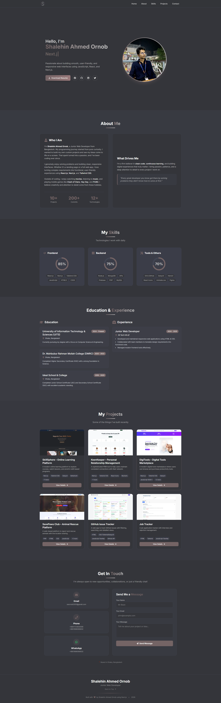

## My – Portfolio

A modern, responsive, and animated portfolio website built with **Next.js**, **Tailwind CSS**, and **Framer Motion**. Designed to showcase the work, skills, and personality of myself, a passionate Web Developer.

- **Live URL:** https://shalehin-ahmed-ornob.vercel.app/

---

## 🚀 Features

- **Fully Responsive** – Works seamlessly on mobile, tablet, and desktop.
- **Smooth Scrolling** – Powered by **Lenis** for buttery smooth navigation.
- **Rich Animations** – Scroll-triggered and hover animations via **Framer Motion**.
- **Hero Section** – Typewriter effect for dynamic role display + gradient name.
- **About Me** – Detailed introduction with stats (projects, commits, technologies).
- **Skills Section** – Categorized skills (Frontend, Backend, Tools) with animated circular progress bars.
- **Projects Section** – 6+ project cards with full details, live demos, and GitHub links.
- **Education & Experience** – Timeline of academic background and work history.
- **Contact Form** – Input form ready to be connected.
- **Footer** – Minimalist footer with a back-to-top button.
- **Dark Theme** – Custom dark color palette with a warm, professional feel.

---

## 🛠️ Tech Stack

| Category           | Technologies                                                                |
| ------------------ | --------------------------------------------------------------------------- |
| Framework          | [Next.js](https://nextjs.org/) (App Router)                                 |
| Styling            | [Tailwind CSS](https://tailwindcss.com/), [DaisyUI](https://daisyui.com/)   |
| Animations         | [Framer Motion](https://www.framer.com/motion/), [Lenis](https://lenis.docs/) |
| Icons              | [React Icons](https://react-icons.github.io/react-icons/)                   |
| Typewriter Effect  | [Typewriter-effect](https://www.npmjs.com/package/typewriter-effect)        |
| Deployment         | [Vercel](https://vercel.com/) (recommended)                                 |
| Font               | [Inter](https://fonts.google.com/specimen/Inter)                            |

---

<!-- # 🏠Portfolio Screenshot:

 
 -->